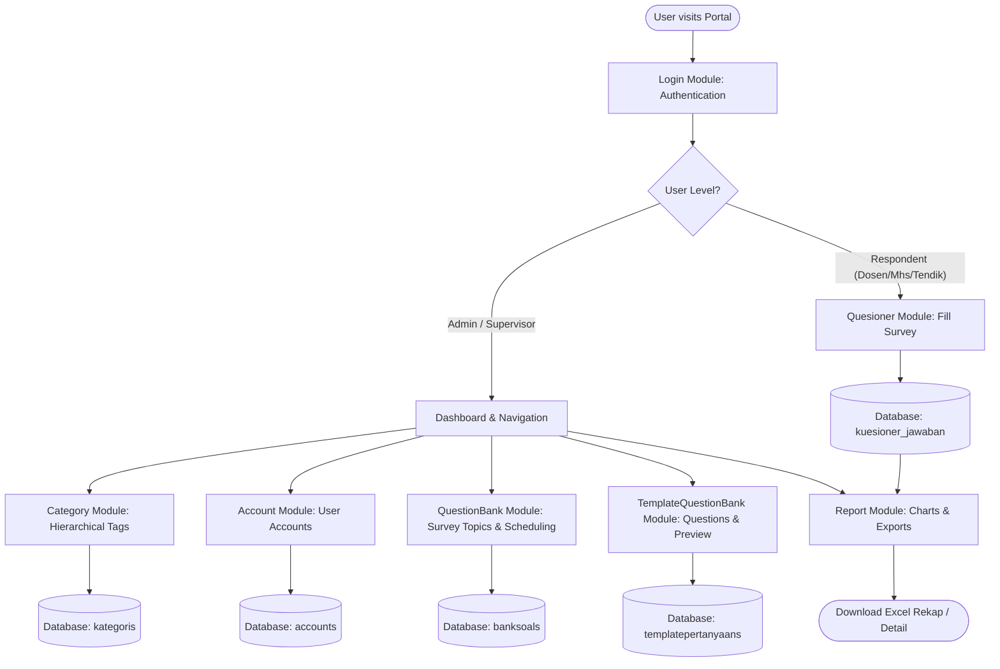
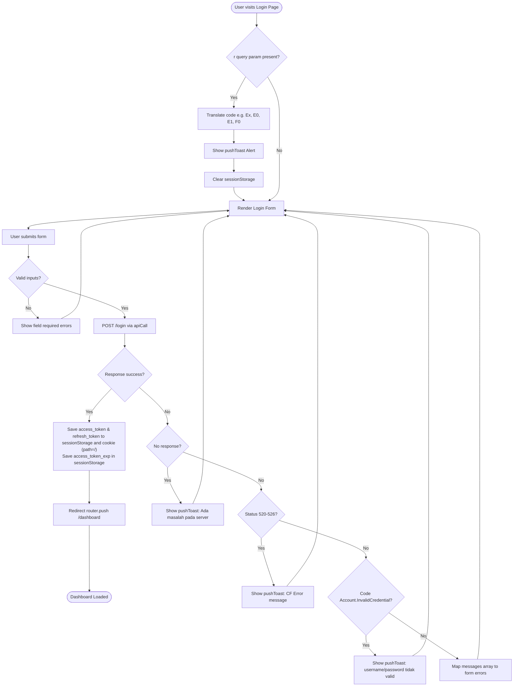
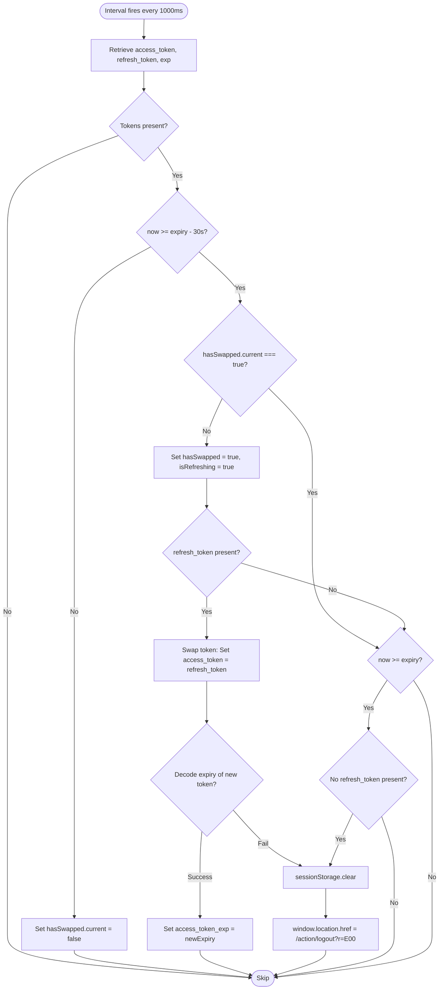
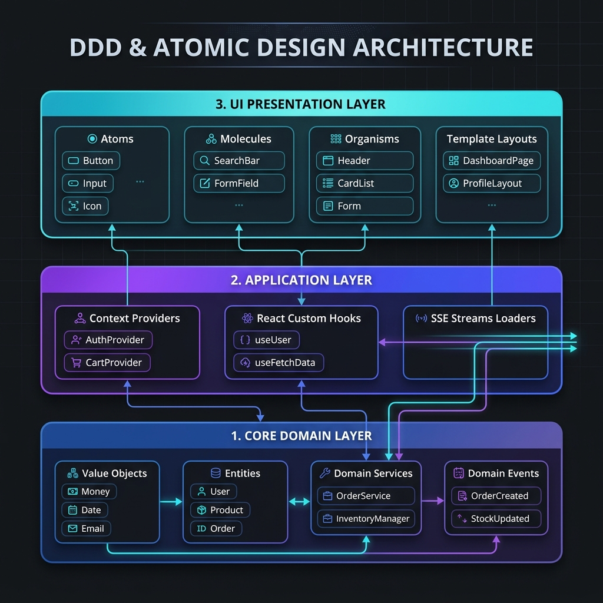
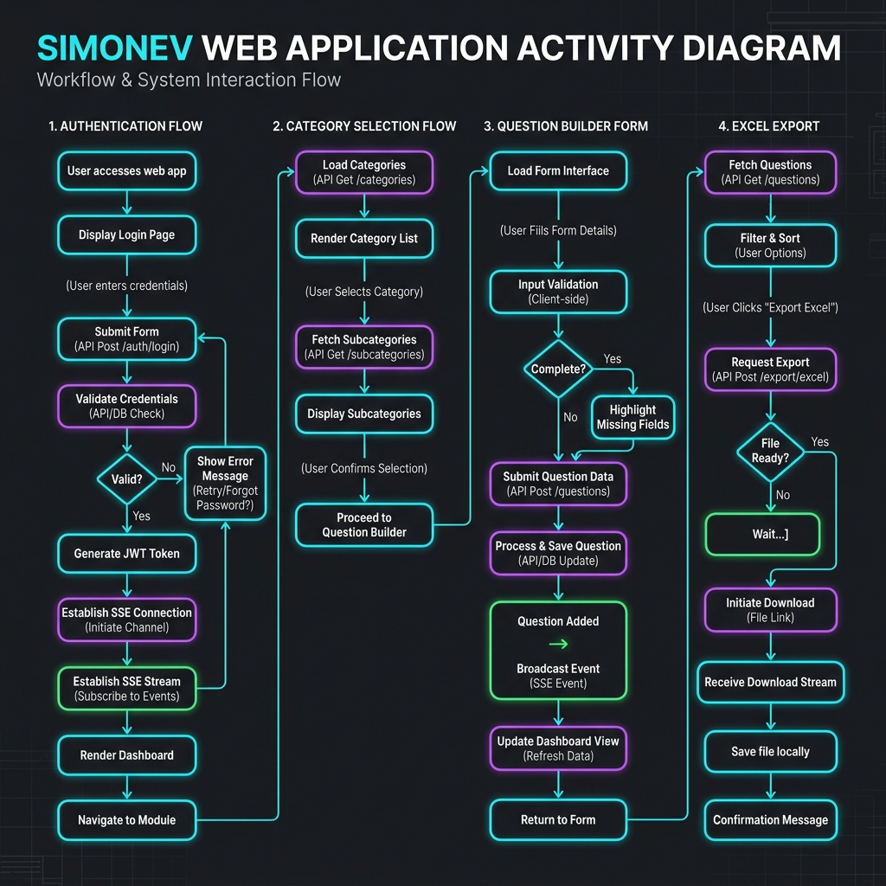
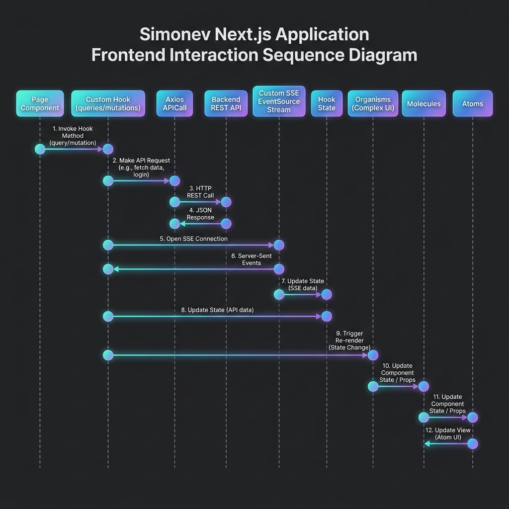
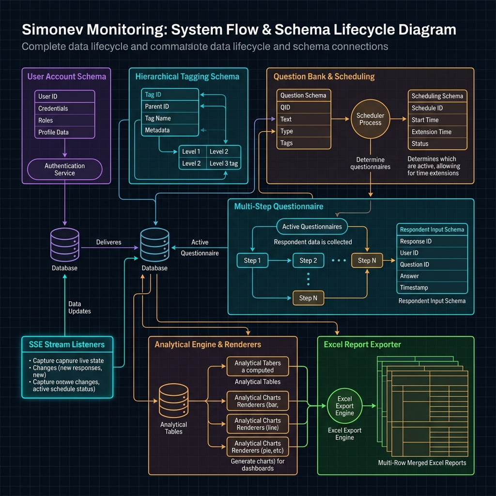

# System Flow & Activity Diagrams

This document outlines the overarching system-wide lifecycle and detailed step-by-step activity schema flows for every module inside the **unpaksimonev** application.

---

## 1. Overarching System Architecture Schema Flow

This high-level flowchart outlines how a user traverses the system, from initial authentication to managing administrative modules, filling out evaluations, and downloading reports.



---

## 2. Authentication & Login Flow

This diagram describes the input validations, token storage actions, and query redirect translation steps for login.



---

## 3. Background Token Watcher Lifecycle

This diagram outlines the automatic background token watcher (`useTokenWatcher`) checks that occur on a 1-second interval to ensure session persistence.



---

## 4. Category Module Flow

Manages tree-hierarchical classifications. Outlines search queries, SSE dropdown syncing, drag-and-drop reordering, and CRUD operations.

```mermaid
flowchart TD
    Start([Visit Category Page]) --> InitSSE[Load SSE feeds in parallel:\n- /fakultass?mode=sse\n- /prodis?mode=sse\n- /kategoris?mode=sse]
    InitSSE --> DisplayTree[Render Flat Tree & Select Dropdowns]
    
    DisplayTree --> UserAction{Select Activity}
    
    UserAction -- Filter & Search --> SearchDebounce[Debounce search query 300ms]
    SearchDebounce --> FetchList[GET /kategoris with query filters]
    FetchList --> RenderTable[Render Category List Grid]
    
    UserAction -- Create/Update --> CategoryForm[Open Form]
    CategoryForm --> SubmitForm[POST /kategori or PUT /kategori/{uuid}]
    SubmitForm --> ResetSSE[Close & Re-initialize SSE Streams] --> DisplayTree
    
    UserAction -- Copy Category --> CopyAction[POST /kategori/{uuid}/copy]
    CopyAction --> ResetSSE
    
    UserAction -- Delete/Restore --> DeleteAction[DELETE /kategori/{uuid} OR\nDELETE /kategori/{uuid}/force OR\nPUT /kategori/{uuid}/restore]
    DeleteAction --> ResetSSE
    
    UserAction -- Reorder Tree --> DnDReorder[Drag-and-Drop item to new position]
    DnDReorder --> PutTree[PUT /kategori with updated flat array]
    PutTree --> ResetSSE
```

---

## 5. Account Module Flow

Handles administrator controls over user profiles, credentials mapping, progressive study program options loading, and CRUD endpoints.

```mermaid
flowchart TD
    Start([Visit Account Page]) --> InitSSE[Load SSE feeds:\n- /fakultass?mode=sse\n- /prodis?mode=sse]
    InitSSE --> DisplayForm[Populate Filter Selectors]
    
    DisplayForm --> QueryList[GET /accounts with search, level, faculty, prodi parameters]
    QueryList --> DisplayTable[Render Account Table Grid]
    
    DisplayTable --> UserAction{Select Action}
    
    UserAction -- Search & Filter --> QueryList
    
    UserAction -- Register User --> OpenForm[Open CreateUserForm]
    OpenForm --> SubmitUser[POST /account]
    SubmitUser --> RefreshList[Refresh GET /accounts] --> DisplayTable
    
    UserAction -- Edit Profile --> OpenEditForm[Open Edit Form]
    OpenEditForm --> UpdateUser[PUT /account/{uuid}]
    UpdateUser --> RefreshList
    
    UserAction -- Delete/Restore --> DelRestore[DELETE /account/{uuid} OR\nDELETE /account/{uuid}/force OR\nPUT /account/{uuid}/restore]
    DelRestore --> RefreshList
```

---

## 6. QuestionBank (Bank Soal) Module Flow

Handles core evaluation questionnaire metadata, status toggle flags, and primary calendar schedules alongside override extensions.

```mermaid
flowchart TD
    Start([Visit QuestionBank Page]) --> LoadSSE[Load SSE feeds:\n- /fakultass?mode=sse\n- /prodis?mode=sse]
    LoadSSE --> QueryBank[GET /banksoals using FilterBuilder predicates]
    QueryBank --> RenderTable[Display QuestionBank Table Grid]
    
    RenderTable --> UserAction{Select Action}
    
    UserAction -- Create/Update --> FormOpen[Open CreateBankSoalForm with CKEditor]
    FormOpen --> SubmitBank[POST /banksoal OR PUT /banksoal/{uuid}]
    SubmitBank --> RefreshBank[Refresh GET /banksoals] --> RenderTable
    
    UserAction -- Status Toggle --> StatusAction[PUT /banksoal/{uuid}/status to ACTIVE/DRAFT]
    StatusAction --> RefreshBank
    
    UserAction -- Copy/Duplicate --> CopyAction[POST /banksoal/{uuid}/copy]
    CopyAction --> RefreshBank
    
    UserAction -- Delete/Restore --> DelAction[DELETE /banksoal/{uuid} OR\nDELETE /banksoal/{uuid}/force OR\nPUT /banksoal/{uuid}/restore]
    DelAction --> RefreshBank
    
    UserAction -- Manage Schedule --> ScheduleForm[Open BankSoalTimeForm Calendar]
    ScheduleForm --> ScheduleAction{Scheduling Command}
    ScheduleAction -- Save Primary/Ext --> PUT_Schedule[PUT /banksoal/{uuid}/schedule]
    ScheduleAction -- Delete Primary --> DEL_Time[DELETE /banksoal/{uuid}/time]
    ScheduleAction -- Delete Extension --> DEL_Ext[DELETE /banksoal/{uuid}/timeext]
    PUT_Schedule --> RefreshBank
    DEL_Time --> RefreshBank
    DEL_Ext --> RefreshBank
```

---

## 7. TemplateQuestionBank Module Flow

Coordinates specific individual question constructs, progressive option feeds, single question answers retrieval, and simulated real-time preview builders.

```mermaid
flowchart TD
    Start([Visit TemplateQuestionBank Page]) --> LoadSSE[Load SSE feeds:\n- /kategoris?mode=sse\n- /banksoals?mode=sse\n- /fakultass?mode=sse\n- /prodis?mode=sse]
    LoadSSE --> QueryTemplates[GET /templatepertanyaans]
    QueryTemplates --> RenderGrid[Display Question Templates Grid]
    
    RenderGrid --> UserAction{Select Action}
    
    UserAction -- Create/Update --> OpenForm[Open CreateTemplateForm]
    OpenForm --> SubmitQuestion[POST /templatepertanyaan OR PUT /templatepertanyaan/{uuid}]
    SubmitQuestion --> RefreshGrid[Refresh GET /templatepertanyaans] --> RenderGrid
    
    UserAction -- Duplicate --> CopyQuestion[POST /templatepertanyaan/{uuid}/copy]
    CopyQuestion --> RefreshGrid
    
    UserAction -- Status Toggle --> ToggleStatus[PUT /templatepertanyaan/{uuid}/status]
    ToggleStatus --> RefreshGrid
    
    UserAction -- Delete/Restore --> DeleteAction[DELETE /templatepertanyaan/{uuid} OR\nDELETE /templatepertanyaan/{uuid}/force OR\nPUT /templatepertanyaan/{uuid}/restore]
    DeleteAction --> RefreshGrid
    
    UserAction -- Fetch Answers --> GetAnswers[GET /templatejawabans for target template UUID]
    GetAnswers --> DisplayAnswers[Show linked answers list]
    
    UserAction -- Live Preview --> PreviewLoader[Launch parallel preview event-stream:\n- /templatepertanyaans?mode=sse\n- /templatejawabans?mode=sse]
    PreviewLoader --> MergePreview[Merge questions and answers real-time]
    MergePreview --> ShowSimulation[Render Interactive Questionnaire Simulation Form]
```

---

## 8. Quesioner Module Flow

Manages respondent survey pages, enforcing concurrent profile and schema evaluations, schedule/extension check boundaries, and multi-field submissions.

```mermaid
flowchart TD
    Start([User visits /quesioner/uuid]) --> ConcurrentFetch[Concurrent Promise.all Fetches:\n- GET /kuesioners/active/{uuid}\n- GET /kuesioner/{uuid}/jawaban\n- GET /whoami]
    ConcurrentFetch --> FetchQuestions[Fetch GET /templatepertanyaan/template_uuid/template for each question]
    FetchQuestions --> ValidateAvailability{Check Date Limits (DateTimeVO) & Extension list (ListExt)?}
    
    ValidateAvailability -- Expired / Unauthorized --> RenderNotFound[Render NotFound or Problem Page]
    
    ValidateAvailability -- Active & Allowed --> CalcSteps[Calculate step accessibility:\n- Admin step\n- Fakultas step\n- Prodi step]
    CalcSteps --> RenderWizard[Render Multi-Step Questionnaire Form]
    
    RenderWizard --> UserInput{Input responses}
    UserInput -- Select score / checkbox --> UpdateState[Update answers state variables]
    UserInput -- Select "Other" option --> RenderTextInput[Render text input field for custom explanation]
    
    UpdateState --> SubmitCheck{User clicks Submit?}
    SubmitCheck -- No --> RenderWizard
    SubmitCheck -- Yes --> ValidateRequired{All mandatory questions answered?}
    
    ValidateRequired -- No --> ShowErrors[Highlight missing questions & scroll to view] --> RenderWizard
    
    ValidateRequired -- Yes --> ConSubmit[POST /kuesioner/{uuid}/jawaban concurrently]
    ConSubmit --> SubmitResult{Submission success?}
    SubmitResult -- Yes --> RenderComplete[Display Complete Thank You Page]
    SubmitResult -- No --> ShowSubmitError[PushToast: Gagal mengirimkan kuesioner] --> RenderWizard
```

---

## 9. Report Module Flow

Outlines chunked readable text-event streams loading, dynamic client-side metric aggregations, and customized spreadsheet serializations.

```mermaid
flowchart TD
    Start([Visit Report Page]) --> LoadSSE[Load SSE feeds:\n- /fakultass?mode=sse\n- /prodis?mode=sse]
    LoadSSE --> StreamReport[POST /kuesioners/report with text/event-stream]
    StreamReport --> ReadableStreamReader[Low-level ReadableStream Reader:\n- Accumulate binary chunks\n- Decode via TextDecoder\n- Parse line-by-line JSON objects]
    ReadableStreamReader --> LoadExtraInfo[GET /templatepertanyaan/{uuid}/banksoal for context metadata]
    LoadExtraInfo --> AccumulateData[Update report state lists]
    
    AccumulateData --> Aggregations["useMemo computations:\n- topQuestions (averages)\n- yearlyStats (dosen, mhs, tendik counts)\n- facultyStats (faculty/prodi counts)"]
    Aggregations --> RenderCharts[Display analytical charts:\n- Recharts Bar, Line, Pie, & Radar charts\n- Distribution table grids]
    
    RenderCharts --> UserAction{Select Export Option}
    
    UserAction -- Export Rekap --> RekapExporter[ExcelJS Rekap Exporter:\n- Filter out duplicate respondents (NIDN/NIP/NPM)\n- Map profiles and global metrics\n- Style column widths & values]
    
    UserAction -- Export Detail --> DetailExporter[ExcelJS Detail Exporter:\n- Correlate questions with multiple user responses\n- Structure row spacing & border headings\n- Merge multi-row cells vertically & horizontally]
    
    RekapExporter --> TriggerDownload[Trigger browser file download saving .xlsx file]
    DetailExporter --> TriggerDownload
```

---

## 10. Visual Architecture & Component Interaction Diagrams

For high-fidelity architectural references, view these generated visual assets:

### A. DDD & Atomic Design Component Pattern
Describes domain boundaries, logic isolation, adapters, hooks, and atomic structure definitions.


### B. High-Fidelity Activity Flow
System-wide user interaction sequences, validation triggers, and route checks.


### C. Visual Component Interaction Sequence
Demonstrates communication pathways between presentation pages, hooks context, and network apiCall modules.


### D. Complete Application Lifecycle Flow
A comprehensive schema flowchart showing all backend API integrations and SSE channels across the application modules.

