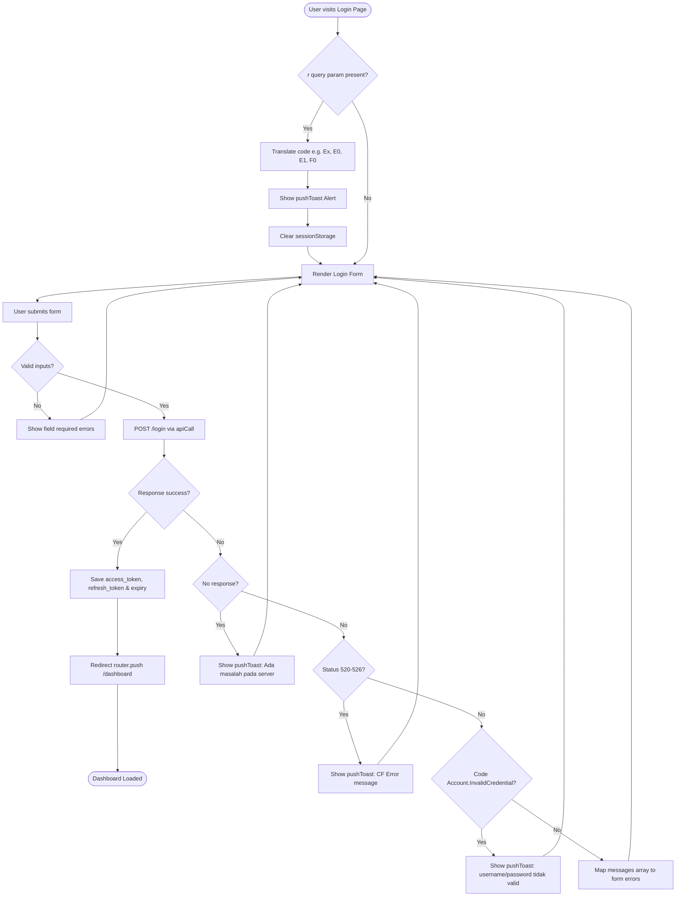

# System Flow & Activity Diagrams

This document outlines key application lifecycles and user flows using Mermaid diagram flowcharts.

---

## 1. Authentication & Login Flow

This diagram describes what happens when a user visits the login portal and submits their credentials.

---

## 2. Background Token Watcher Swap Lifecycle

This diagram outlines the automatic background token watcher (`useTokenWatcher`) checks that occur on a 1-second interval to ensure session persistence.

---

## 3. Visual System Activity Diagram

This diagram displays the full system activity schema, showing the transitions and relationships between authentication, admin CRUD modules, SSE stream syncs, client questionnaire builders, and report exports:

---

## 4. Visual Component Interaction Sequence Diagram

This sequence diagram displays how different components, custom hooks, and external API services communicate:

---

## 5. Complete Project Flow & Lifecycle Activity Diagram

